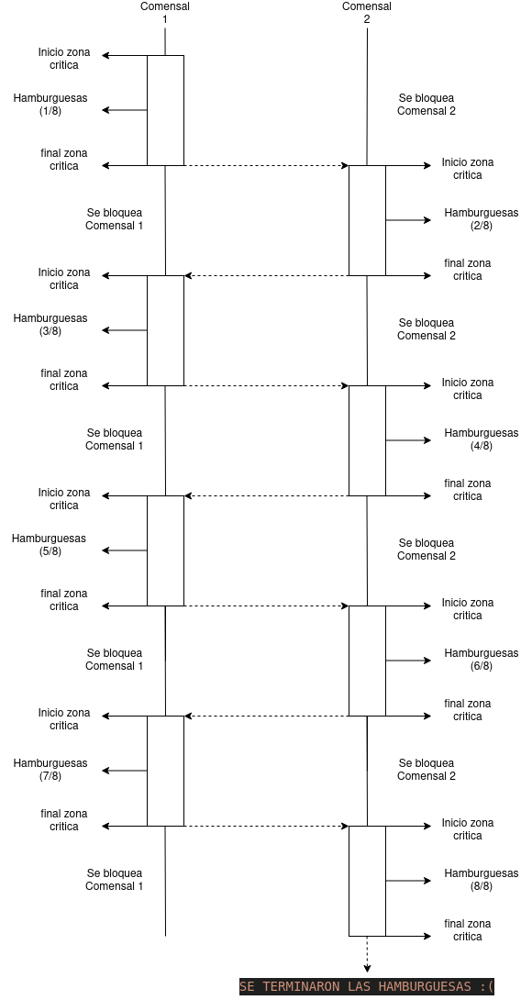

# 1)

#### a- 
sinhilos.py: demoro poco mas de 5 segundos en ejecutarse.
conhilos.py: demoro poco mas de 4 segundos en ejecutarse.

Con respecto al tiempo de ejecucion, se puede notar que al ejecutar un archivo que utilize multiples hilos este puede ejecutar varias tareas en 
simultaneo, mientras que sin hilos lo ejecuta secuencialmente, siendo esta segunda opcion claramente la mas tardada, por lo tanto,los resultados en 
cuanto a tiempos de ejecucion se podria decir que son predecibles.

#### b-
Al comparar los tiempos de ejecucion con 2 compañeros, se puede observar que si bien no son resultados exactamente iguales, cumplen con la caracteristica 
de que al ejecutar el mismo codigo con hilos es menos tardado que al hacerlo sin ellos.

#### c-
Previo a descomentar el programa arroja siempre el mismo resultado variando levemente el tiempo, pero al descomentar el ciclo for, este le 
agrega una carga al cpu haciendo que el proceso de ejecucion sea mas tardado y asi aumentando la carga de trabajo provocando problemas de 
sincronizacion de los hilos con la variable "acumulador", lo que ocaciona que este arroje resutlados diferentes en cada ejecucion tanto en la 
variable como en el tiempo de ejecucion.

# 2)

#### a-
#include <pthread.h>
#include <stdio.h>
#include <stdlib.h>
#define NUMBER_OF_THREADS 2
#define CANTIDAD_INICIAL_HAMBURGUESAS 20
int cantidad_restante_hamburguesas = CANTIDAD_INICIAL_HAMBURGUESAS;
int turno = 0;

void *comer_hamburguesa(void *tid)
{
	while (1 == 1)
	{ 
		while(turno!=(int)tid);
    // INICIO DE LA ZONA CRÍTICA
		if (cantidad_restante_hamburguesas > 0)
		{
			printf("Hola! soy el hilo(comensal) %d , me voy a comer una hamburguesa ! ya que todavia queda/n %d \n", (int) tid, cantidad_restante_hamburguesas);
			cantidad_restante_hamburguesas--; // me como una hamburguesa
		}
		else
		{
			printf("SE TERMINARON LAS HAMBURGUESAS :( \n");

			pthread_exit(NULL); // forzar terminacion del hilo
		}
    // SALIDA DE LA ZONA CRÍTICA   
		turno = (turno + 1)% NUMBER_OF_THREADS;
	}
}

int main(int argc, char *argv[])
{
	pthread_t threads[NUMBER_OF_THREADS];
	int status, i, ret;
	for (int i = 0; i < NUMBER_OF_THREADS; i++)
	{
		printf("Hola!, soy el hilo principal. Estoy creando el hilo %d \n", i);
		status = pthread_create(&threads[i], NULL, comer_hamburguesa, (void *)i);
		if (status != 0)
		{
			printf("Algo salio mal, al crear el hilo recibi el codigo de error %d \n", status);
			exit(-1);
		}
	}

	for (i = 0; i < NUMBER_OF_THREADS; i++)
	{
		void *retval;
		ret = pthread_join(threads[i], &retval); // espero por la terminacion de los hilos que cree
	}
	pthread_exit(NULL); // como los hilos que cree ya terminaron de ejecutarse, termino yo tambien.
}

#### b-
